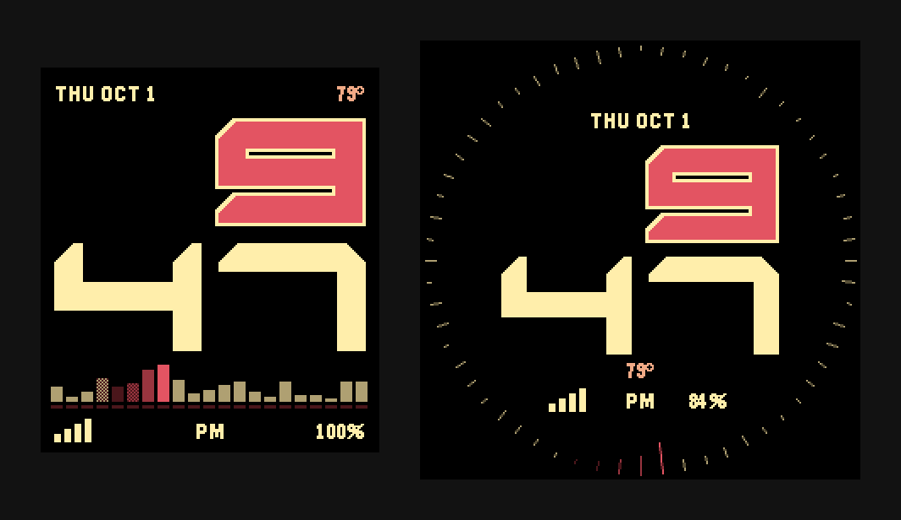
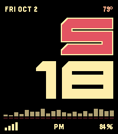
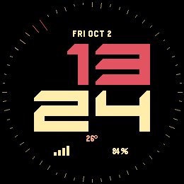
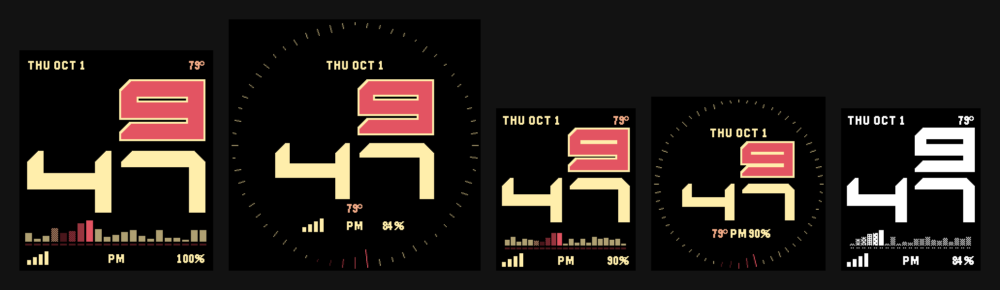

# Entity



Entity is a watchface for the Pebble Time 2 and Pebble Round 2. It also runs on the original
Pebble Time, Time Steel and Time Round, and on the Pebble 2 Duo.

Install it from the [Pebble appstore](https://apps.repebble.com/7beca89f985f493dbccbd9bd), or
search for Entity in the Pebble app on your phone. It's free.

Most of the screen is the time, in big bold numerals with the hour stacked over the minute. Along
the bottom is a row of bars that shows whether your watch can reach your phone. Flick your wrist
and a red bar glides side to side across them, trailing a little orange, then settles after half
a minute. If the connection drops, the bars flatten out and turn grey, so you can tell at a glance.

The top of the screen has the date and the temperature. Double tap the watch and it switches over
to your steps and heart rate for ten seconds, then flips back.

On the round watches the bars wrap around the edge of the screen as tick marks. The red one steps
round once a second, a full lap each minute, then turns at the top and goes back the other way.
The round watches have no heart-rate sensor, so a double tap there shows just your steps.

## See it move

Both clips come from the Pebble emulator at the watches' own resolution. The Time 2 opens on a
wrist flick, then shows a double tap, the phone dropping out and coming back, low battery,
charging and a timeline peek. The Round 2 runs through the same things, apart from the flick and
the peek.

<p>
  
  
</p>

## Every watch



Left to right: Pebble Time 2, Pebble Round 2, Pebble Time (the Time Steel looks the same), Time
Round, and Pebble 2 Duo in black and white.

## Battery

The moving bar is the one thing here that really costs power, so it only moves when you're likely
to be looking: briefly at each new minute, and for a while after you flick your wrist. The rest of
the time the bars sit still. It won't move at all when your battery is low (20% unless you pick a
different number in the settings), during quiet time, while a timeline peek covers the screen, or
if you switch the animation off.

The round watches skip the bursts: the red tick moves once a second, which is cheap, and stops
under the same conditions.

## Type

The numerals are drawn as blocky shapes, so the face carries no font files. Labels use
Pebble's own Gothic, which is built into the watch.

## Development

To build it you need the Pebble tool and SDK 4.33.1:

```sh
uv tool install pebble-tool
pebble sdk install 4.33.1
pebble build
pebble install --emulator emery --vnc
```

`make -C tests/host` runs the unit tests for the formatting and drawing logic.

## Licence

Entity is free software under the GNU General Public License, version 3 or later (see
[LICENSE](LICENSE)). Forks are welcome. If you share a changed version, it stays under the same
licence.
